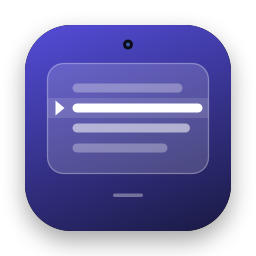
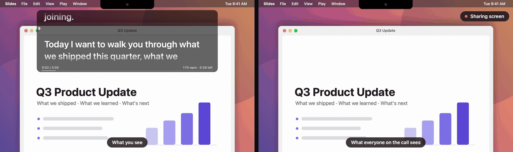
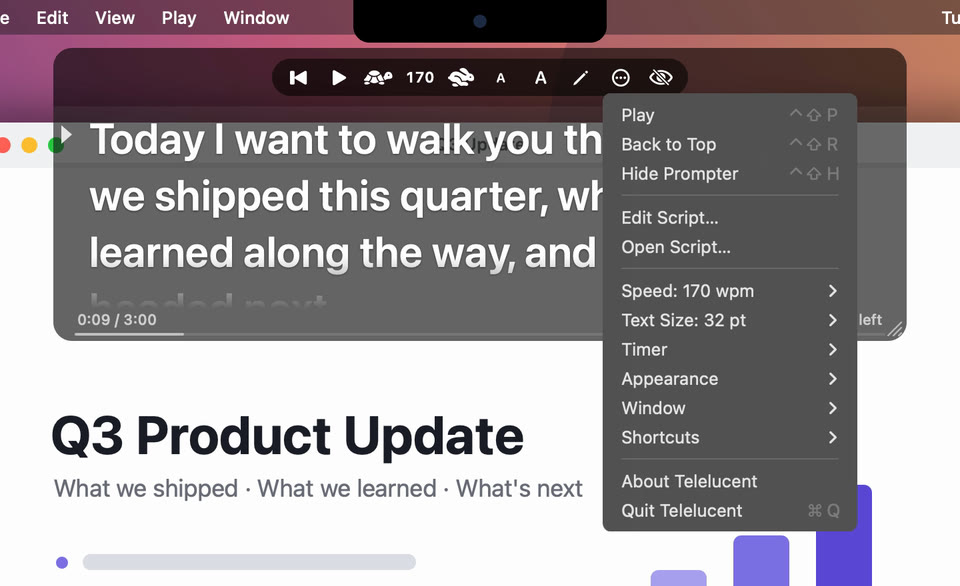
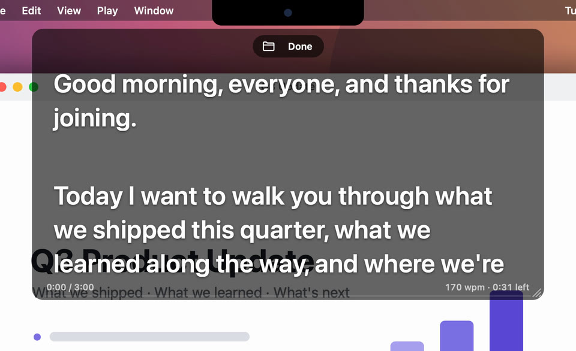

<div align="center">



# Telelucent

**A see-through teleprompter for your Mac that doesn't show up when you share your screen.**

Read your notes right under the camera during calls, demos and recordings.<br>
The people watching only see your slides.

<a href="https://github.com/samir-sarwar/telelucent/releases/latest/download/Telelucent.zip"><b>⬇ Download for macOS</b></a>
&nbsp;·&nbsp; 460 KB &nbsp;·&nbsp; macOS 12+ &nbsp;·&nbsp; Apple Silicon & Intel &nbsp;·&nbsp; Free & open source

<br>



<sub>Left is your screen. Right is the same moment in the screen share. The prompter isn't there.</sub>

</div>

---

## Features

- **Invisible to screen sharing and recordings.** macOS leaves the prompter out of anything that captures the screen: Zoom, Meet, Teams, OBS, QuickTime, screenshots.
- **See-through.** Pick how dark the background is, or add a frosted blur.
- **Never steals focus.** Clicking or scrolling the prompter keeps the app you're presenting in front.
- **Hands on the keyboard.** Global shortcuts play, pause, scroll, change speed and resize text from any app, so your pointer never has to wander over to an empty patch of your shared screen.
- **Scroll from anywhere** *(optional)*. Hold <kbd>⌃</kbd><kbd>⇧</kbd> and swipe on the trackpad over any window. The prompter scrolls and the window under your pointer doesn't.
- **Timing.**
  - Speed is set in words per minute.
  - A talk timer shows how much time is left at your current pace, and warns you when you're running long.
  - Optional 3‑2‑1 countdown.
  - "Finish the rest in N minutes" picks the speed for you.
- **Make it fit.** Resize the window, change the text size, center or mirror the text, and keep a reading guide on the current line.
- **Bring your script.** Paste it in, edit in place, or drop a `.txt`, `.md`, `.rtf`, `.docx`, `.odt` or `.html` file on it.
- **Tiny and quiet.**
  - Around 460 KB to download.
  - About 2% CPU while scrolling and 0% while paused, using ~25 MB of memory.
  - No network access and no analytics.

## Install

### Option 1: Download

1. Download **[Telelucent.zip](https://github.com/samir-sarwar/telelucent/releases/latest/download/Telelucent.zip)** and unzip it.
2. Drag **Telelucent.app** into your **Applications** folder.
3. Open it. Telelucent isn't signed with a paid Apple Developer ID, so macOS will stop it the first time:
   - **macOS 15 Sequoia and later:** click **Done** on the warning. Then go to **System Settings → Privacy & Security**, scroll down, click **Open Anyway** next to Telelucent, and confirm.
   - **macOS 14 and earlier:** Control-click (right-click) the app, choose **Open**, then **Open** again.

   You only have to do this once. If you'd rather use Terminal, this does the same thing:

   ```bash
   xattr -dr com.apple.quarantine /Applications/Telelucent.app
   ```

### Option 2: One line in Terminal

This downloads the latest release into `/Applications` and opens it. Files fetched this way aren't quarantined, so there's no warning to click through.

```bash
curl -fsSL https://raw.githubusercontent.com/samir-sarwar/telelucent/main/scripts/install.sh | bash
```

Run it again any time to update.

### Option 3: Build it yourself

You only need Apple's Command Line Tools (`xcode-select --install`), not Xcode.

```bash
git clone https://github.com/samir-sarwar/telelucent.git
cd telelucent
make install
```

## Getting started

1. **Open Telelucent.** The prompter appears at the top of your screen, right under the camera, and a scroll icon appears in the menu bar. There's no Dock icon.
2. **Add your script.** Double-click the text, or click the pencil in the toolbar, and paste. Press <kbd>Esc</kbd> or click **Done** when you're finished. You can also drop a file onto the prompter.
3. **Press <kbd>⌃</kbd><kbd>⇧</kbd><kbd>P</kbd> to start.** Press it again to pause.
4. **Share your screen as usual.** Everyone else sees your screen without the prompter.

> [!TIP]
> Want to be sure? Before an important call, take a screenshot or a quick recording with <kbd>⌘</kbd><kbd>⇧</kbd><kbd>5</kbd>, or share your screen into a test meeting. The prompter won't be in it.

## Controls

### Keyboard (works in any app)

| Shortcut | What it does |
| --- | --- |
| <kbd>⌃</kbd><kbd>⇧</kbd><kbd>P</kbd> | Play / pause (press during the countdown to skip it) |
| <kbd>⌃</kbd><kbd>⇧</kbd><kbd>↓</kbd> / <kbd>↑</kbd> | Hold to scroll forward / back. Speeds up the longer you hold. |
| <kbd>⌃</kbd><kbd>⇧</kbd><kbd>→</kbd> / <kbd>←</kbd> | Faster / slower, 10 words per minute at a time |
| <kbd>⌃</kbd><kbd>⇧</kbd><kbd>=</kbd> / <kbd>−</kbd> | Bigger / smaller text |
| <kbd>⌃</kbd><kbd>⇧</kbd><kbd>R</kbd> | Back to the top and reset the timer |
| <kbd>⌃</kbd><kbd>⇧</kbd><kbd>H</kbd> | Hide / show the prompter |
| <kbd>Esc</kbd> | Finish editing |

These use Control‑Shift so they don't clash with window managers like Rectangle, which use Control‑Option. If something else on your Mac already uses them, switch to <kbd>⌃</kbd><kbd>⌥</kbd> or <kbd>⌃</kbd><kbd>⌥</kbd><kbd>⌘</kbd> under **Shortcuts** in the menu.

### Mouse and trackpad

- **Scroll** over the prompter to move through the script. It won't pull focus from the app you're presenting.
- **Drag** the text to move the prompter. **Drag an edge**, or the grip in the bottom-right corner, to resize it.
- **Hover** over it to reveal the toolbar: back to top, play, slower/faster, text size, edit, settings, hide.
- **Double-click** to edit.

<table>
<tr>
<td width="50%"></td>
<td width="50%"></td>
</tr>
<tr>
<td align="center"><sub>Hover for the toolbar. The ⋯ button (or the menu bar icon) has every setting.</sub></td>
<td align="center"><sub>Edit in place. You come back to the line you were reading.</sub></td>
</tr>
</table>

## Timing

The strip along the bottom of the prompter looks like this:

```
0:42 / 5:00                                  150 wpm · 3:10 left
━━━━━━━━━━━━━━━━━━━━━━━━──────────────────────────────────────────
```

- **Left:** how long you've been talking. The clock starts the first time you press play and keeps going while you're paused, since you're probably still talking. It stops when the script ends. <kbd>⌃</kbd><kbd>⇧</kbd><kbd>R</kbd> resets it.
- **Talk length** *(Timer → Talk Length)*: shows your time limit next to the clock. The clock turns **yellow** at 90% and **red** once you're over.
- **Right:** your speed, and how long the rest of the script will take at that speed. It turns **orange** if you're on track to run past your talk length.
- **Speed → Finish the Rest In…** sets the words per minute so you end on time.
- **Timer → Countdown** gives you a 3 or 5 second 3‑2‑1 before scrolling starts from the top.

Most people speak at about 130–160 words per minute. Start at 140 and adjust as you go with <kbd>⌃</kbd><kbd>⇧</kbd><kbd>→</kbd> / <kbd>←</kbd>.

## Settings

Everything lives under the scroll icon in the menu bar, and under ⋯ in the prompter's toolbar.

| Menu | Options |
| --- | --- |
| **Speed** | Presets from 100–200 wpm, faster/slower, finish the rest in 1–30 minutes |
| **Text Size** | Presets from 24–72 pt, bigger/smaller |
| **Timer** | Show/hide the timer, talk length, countdown |
| **Appearance** | Background darkness (20–100%), blur behind, center text, mirror text (for teleprompter glass), reading guide |
| **Window** | Small / Medium / Large, move back under the camera, hide from screen sharing (on by default) |
| **Shortcuts** | Turn global shortcuts on/off, choose the modifier keys, scroll anywhere |

### Scroll anywhere

With **Shortcuts → Scroll Anywhere** turned on, hold <kbd>⌃</kbd><kbd>⇧</kbd> (or whichever modifiers you picked) and scroll with the trackpad or mouse wheel over any app. The prompter scrolls, and the window underneath doesn't. That way your viewers never see the page jump or your pointer wander off.

To stop that scroll from reaching the app underneath, Telelucent needs **Accessibility** permission. macOS asks the first time you turn it on. Grant it in **System Settings → Privacy & Security → Accessibility** and it starts working right away.

## Automation

Telelucent answers to a `telelucent://` URL, so you can control it from Shortcuts, Raycast, Alfred, a Stream Deck or a script. Use `open -g` so Telelucent doesn't come to the front:

```bash
open -g "telelucent://toggle"
```

The other commands are `play`, `pause`, `restart`, `faster`, `slower`, `bigger`, `smaller`, `show` and `hide`.

## How it works

- **Hidden from capture.** The prompter window sets [`NSWindow.sharingType`](https://developer.apple.com/documentation/appkit/nswindow/sharingtype) to `.none`, which tells macOS to leave it out of screen capture. Screen-sharing and recording apps go through the system's capture APIs, which respect that. I tested it against ScreenCaptureKit and `screencapture` on macOS 15: captures with the prompter showing and hidden came out pixel-for-pixel identical.
- **Never takes focus.** It's a non-activating floating panel. It stays above your other windows on every Space without ever becoming the frontmost app.
- **Shortcuts without permissions.** Global shortcuts use the system hot key API, which doesn't need Accessibility access. Only the optional scroll-anywhere feature does.
- **Cheap scrolling.** Scrolling a normal text view repaints the text every frame, which cost about 35% CPU in early testing. While prompting, Telelucent draws the text once into small image tiles and just slides them up. It runs at the display's refresh rate only while the text is actually moving, and does nothing otherwise.
- **Small.** It's under 2,000 lines of Swift using only AppKit, with no frameworks or dependencies. It's built as a universal binary with size optimizations.

> [!NOTE]
> Hiding only applies to software capture. Anything that shows your actual display will show the prompter: a mirrored projector or TV, an HDMI capture card, or a camera pointed at your screen. Menus you open from Telelucent are ordinary menus, so they're visible while open.

## Troubleshooting

<details>
<summary><b>A shortcut doesn't do anything</b></summary>

Another app probably owns that key combination. Pick different modifier keys under **Shortcuts** in the menu.
</details>

<details>
<summary><b>I can't find the menu bar icon</b></summary>

On Macs with a notch, menu bar icons can get hidden when the bar is full. Hover over the prompter and use the ⋯ button in its toolbar instead. If you hid the prompter, open Telelucent again from Applications or Spotlight to bring it back.
</details>

<details>
<summary><b>Scroll anywhere stopped working after an update</b></summary>

macOS ties the Accessibility permission to the exact build of the app. After updating, remove Telelucent from **System Settings → Privacy & Security → Accessibility**, then turn **Scroll Anywhere** off and on again.
</details>

<details>
<summary><b>macOS says the app is damaged or can't be opened</b></summary>

That's the quarantine flag on an app that isn't notarized. Follow step 3 of [Install](#option-1-download), or run:

```bash
xattr -dr com.apple.quarantine /Applications/Telelucent.app
```
</details>

## Privacy

Telelucent never connects to the internet. Your script is saved on your Mac at `~/Library/Application Support/Telelucent/script.txt`, and your settings are saved in the app's standard preferences.

## Uninstall

Quit Telelucent from its menu, delete it from Applications, and, if you want, remove its data:

```bash
rm -rf ~/Library/Application\ Support/Telelucent
defaults delete com.samirsarwar.telelucent
```

## Building

```bash
make            # build/Telelucent.app (universal)
make run        # build and launch
make install    # copy into /Applications
make release    # build/Telelucent.zip for a GitHub release
make icon       # redraw Resources/AppIcon.icns
```

```
Sources/
  PrompterController.swift   playback, timer, countdown, editing
  PrompterView.swift         the panel's contents and layout
  TextCanvas.swift           tiled text rendering used while prompting
  PrompterPanel.swift        the floating, non-activating, capture-proof window
  HotKeys.swift              global shortcuts
  ScrollTap.swift            optional scroll-anywhere event tap
  StatusMenu.swift           menu bar icon and settings
  Overlays.swift             timer strip, countdown, toasts
  Toolbar.swift              hover toolbar and resize grip
  DisplayLink.swift, Prefs.swift, Script.swift, AppDelegate.swift, main.swift
```

## License

[MIT](LICENSE) © Samir Sarwar
